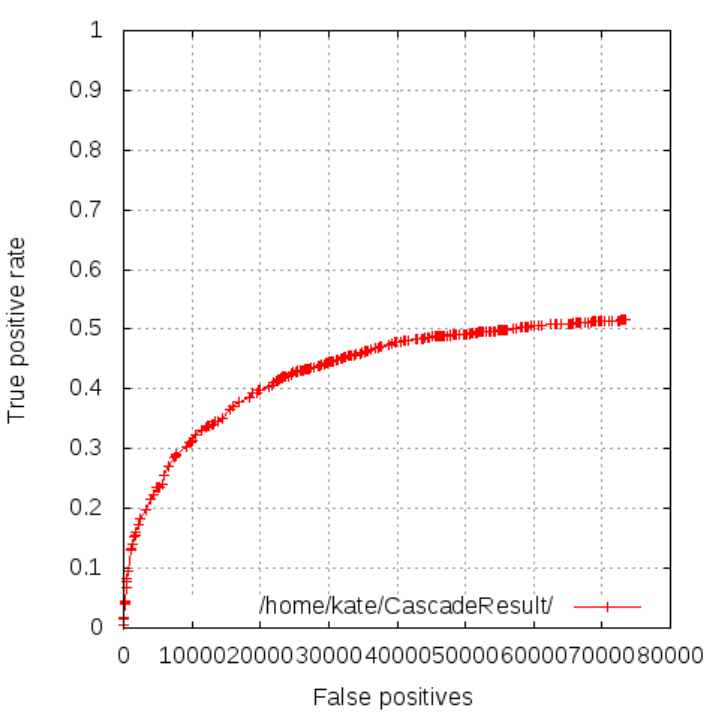
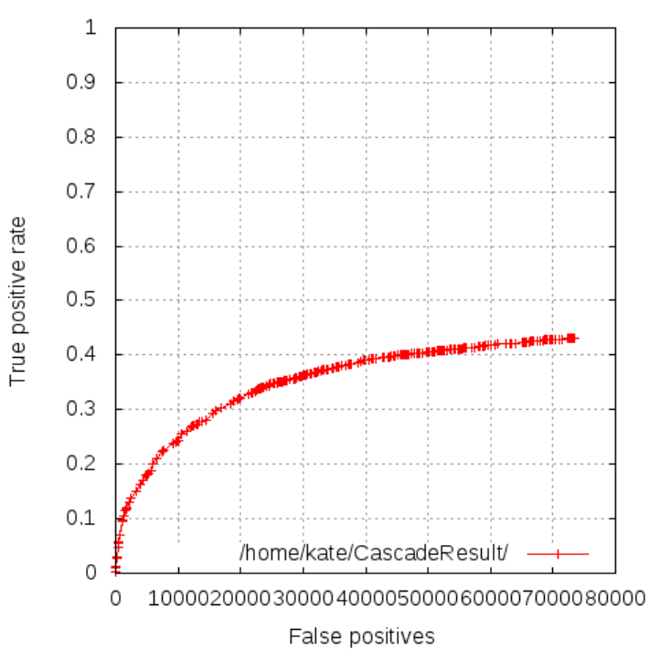
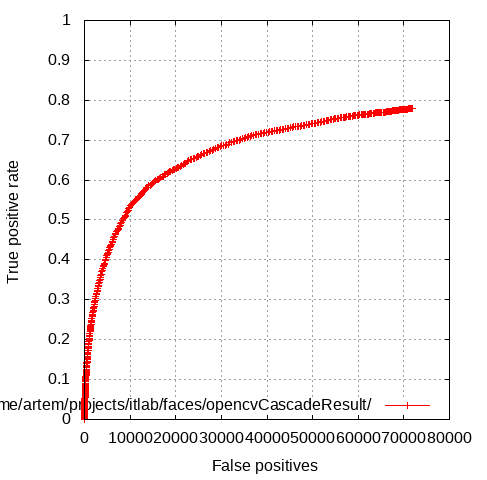
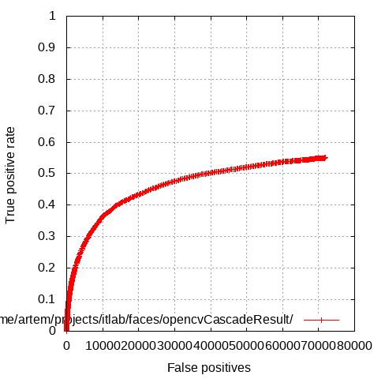

# ITLab Vision — Biweekly Report — 06 November 2014

----------------

## Результаты

  1. Интеграции разработанных фотоэффектов в opencv_contrib:
     - Внесены все необходимые правки для успешной сборки модуля на build-bot ([pull request](https://github.com/Itseez/opencv_contrib/pull/112)).

  1. Работа с библиотеками глубинного обучения:
     - Устранены все недочеты по сборке и установке библиотек (Pylearn2, Caffe, Torch).
	 - Обучены [различные](https://drive.google.com/open?id=0B1Xio1gViu12c0czOUFJNVoxWUU&authuser=0) [модели](https://github.com/KruchDmitriy/DNN-develop) для задачи классификации рукописных цифр (база MNIST) с помощью трех указанных библиотек. Результаты сравнения частично занесены в [таблицу](https://docs.google.com/spreadsheets/d/1U5v-xap-dkm5Hu-uh49nn7NEwNafjEE9Bos9qsz0wo0/edit?usp=sharing).

  1. Изучение алгоритмов детектирования пешеходов, автомобилей, лиц:
     - Написана [инструкция](https://docs.google.com/document/d/1GL4eog24T4fKL0_b12TUz3jOKqE3yL_MGD6pPcwg7Xw/edit?usp=sharing) по сборке и использованию [программы](http://vis-www.cs.umass.edu/fddb/results.html) построения кривых качества работы детектора лиц.
	 - Получены кривые качества работы каскадного детектора лиц с LBP-признаками (модель lbpcascade_frontalface.xml)
	   , 
	   и с признаками Хаара (модель haarcascade_frontalface_alt.xml)
	   , 
	 - Выкачаны [наборы данных](http://www.vision.caltech.edu/Image_Datasets/CaltechPedestrians/datasets/) для детектирования пешеходов. Изучен формат представления данных. 
	 - Написан [код](https://github.com/VladVin/obj-detect-classifiers/tree/master/src/icfdetector) для обучения и тестирования детектора ICF (Integral Channel Features) из opencv_contrib. Работоспособность кода проверена на небольшом объеме данных (подвыборка изображений набора INRIA для детектирования пешеходов). 

## Планы

  1. Интеграция разработанных фотоэффектов в opencv_contrib:
     - Сократить объем данных (изображений) используемых в документации и регрессионных тестах.

  1. Работа с библиотеками глубинного обучения:
     - Выбрать максимально похожие конфигурации сетей и параметры алгоритмов обучения для непосредственного сравнения качества и скорости работы различных библиотек.
	 - Привести таблицы с результатами в порядок.
	 - Выбрать топологии сетей и алгоритмы обучения зарекомендовавшие себя для решения задачи детектирования пешеходов и протестировать их.

  1. Изучение алгоритмов детектирования пешеходов, автомобилей, лиц:
     - Скорректировать код построения графиков качества детекторов лиц, чтобы сделать их более понятными. Сравнить полученные результаты с имеющимися на [сайте](http://vis-www.cs.umass.edu/fddb/results.html).
	 - Протестировать каскадный классификатр с признаками Хаара на задаче детектирования лиц.
	 - Провести полномасштабный эксперимент (обучение и тестирование) по оценке качества ICF-детектора для детектирования пешеходов.
