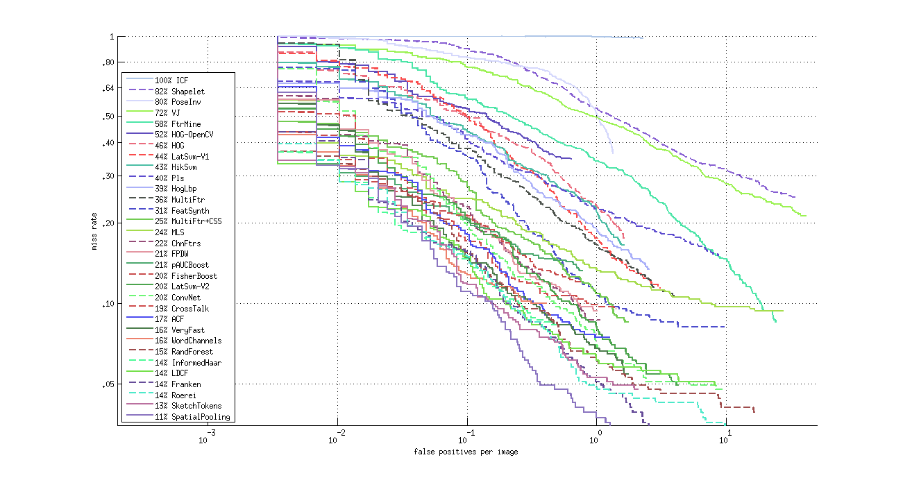

# ITLab Vision — Biweekly Report — 10 December 2014

----------------

## Результаты

  1. Работа с библиотеками глубинного обучения:
     - Отлажена [С++-обертка][torch-cpp-wraper] для использования
     классификаторов, обученных с помощью Torch, для детектирования объектов
     на изображениях.
     - Натренировано несколько нейронных сетей для детектирования лиц
     (cnn-face и cnn3-face в [таблице][res-table]).
     - Идет отладка С++-обертки для Caffe-классификаторов.

  1. Изучение алгоритмов детектирования пешеходов, автомобилей, лиц:
     - Приведены к единому формату следующие наборы данных,
     которые можно использовать для тренировки детектора лиц:
     [Caltech][caltech], [FERET][feret], [FEI][fei], [Genki][genki], [IMM][imm],
      [BioID][bioid], [MUCT][muct], [CIE_Biometrics][cie-biometrics].
     - С использованием этих наборов данных обучены каскадные детекторы лиц
     с LBP-признаками. Сравнение качества полученных детекторов с моделями
     из OpenCV представлено на рис. 1.
     - Настроена инфраструктура для оценки качества детекторов пешеходов
     с использованием [Matlab evaluation/labeling code][caltech-eval].
     - Оценено качество HOG-детектора из OpenCV на тестовой части базы INRIA,
     результаты представлены на рис. 2.

.png)\
__Рис. 1. Сравнение полученных детекторов лиц с моделями из OpenCV.__

\
__Рис. 2. Сравнение HOG-детектора из OpenCV (HOG-OpenCV) с результатами из
[CalTech Pedestrian Detection Benchmark][caltech-benchmark] на базе INRIA.__

## Планы

  1. Работа с библиотеками глубинного обучения:
     - Доделать С++-обертку для Caffe-классификаторов.
     - Выбрать конфигурации сетей и алгоритмы обучения
     для решения задачи детектирования лиц.
     - Выбрать конфигурации сетей и алгоритмы обучения
     для решения задачи детектирования пешеходов.
     - Написать статью, содержащую сравнение библиотек глубинного обучения.
     - Подготовиться к проведению семинара (ориентировочная дата - 26.12.2014).

  1. Изучение алгоритмов детектирования пешеходов, автомобилей, лиц:
     - Обучить каскадный классификатор с признаками Хаара
     на большой базе изображений.
     - Сделать небольшой обзор алгоритмов глубинного обучения,
     успешно примененных для решения задачи детектирования пешеходов.

<!-- LINKS -->

[torch-cpp-wraper]: https://github.com/ITLab-Vision/FDDB/blob/master/ItlabFaceDetector/src/DigitClassifier.cpp
[res-table]: https://docs.google.com/spreadsheets/d/1U5v-xap-dkm5Hu-uh49nn7NEwNafjEE9Bos9qsz0wo0/edit?usp=sharing
[caltech]: http://www.vision.caltech.edu/Image_Datasets/Caltech_10K_WebFaces/
[feret]: http://www.itl.nist.gov/iad/humanid/feret/feret_master.htm
[fei]: http://fei.edu.br/~cet/facedatabase.html
[genki]: http://mplab.ucsd.edu/wordpress/?page_id=398
[imm]: http://www.imm.dtu.dk/~aam/datasets/datasets.html
[bioid]: https://www.bioid.com/About/BioID-Face-Database
[muct]: http://www.milbo.org/muct/
[cie-biometrics]: https://biometrics.cie.put.poznan.pl/index.php?option=com_content&view=article&id=4%3Aopis&catid=12%3Aput-face&Itemid=2&lang=en
[caltech-benchmark]: http://www.vision.caltech.edu/Image_Datasets/CaltechPedestrians/
[caltech-eval]: http://www.vision.caltech.edu/Image_Datasets/CaltechPedestrians/code/code3.2.1.zip
