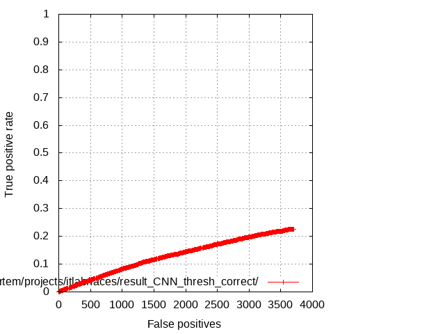
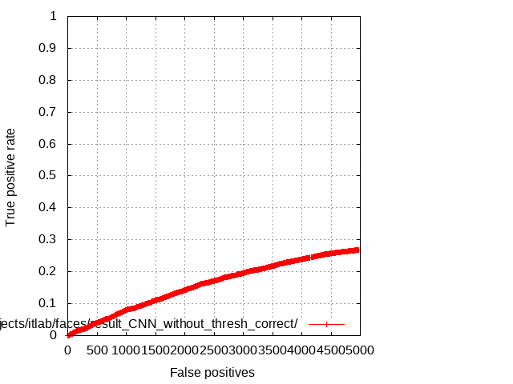
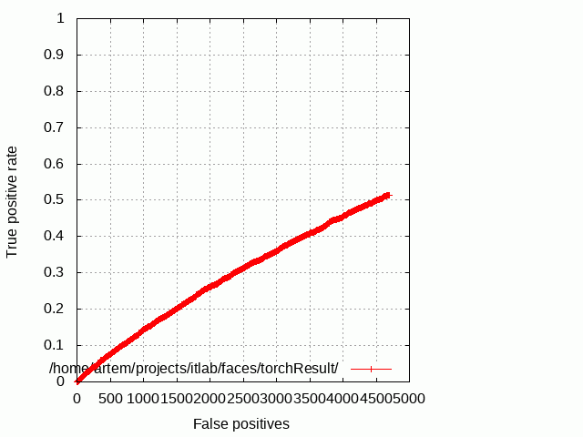

# ITLab Vision — Weekly Report — 20 March 2015

----------------

## Результаты

  1. Виноградов Владислав
     - Обучение: просмотрены несколько лекций Воронцова из курса
     `Машинное обучение`, полистаны страницы стенфордского курса.
  1. Долотов Евгений
     - Заработал классификатор C++ для Caffe. Проверял на mnist. 
  1. Кручинин Дмитрий
     - Частично исправлены замечания по статье на [АИСТ][aist].
     - Создан шаблон презентации для семинара 27.03.
  1. Малютина Екатерина
     - Закончила с наборами изображений лиц,
     сделала [описание][face-classifier-datasets] каждого обработанного набора
     и залила приложение.
	   - Отредактировала [описание][haar-roc-curves] результатов
     обучения каскадных детекторов лиц с признаками Хаара.
	   - Нашла две статьи на прочтение по детектированию лиц с использованием
     нейронных сетей: [первая][nn-face-det-1] и [вторая][nn-face-det-2] .
  1. Скребков Артем
     - Протестировал детектор на fddb на модели CNN,
     Roc-кривые на Рис. 1 и Рис. 2 ниже и они не очень. 
     Даже раньше было лучше Рис. 3. 

\
__Рис. 1. Модель CNN, с отсечением результатов по порогу.__

\
__Рис. 2. Модель CNN, без отсечения результатов по порогу.__

\
__Рис. 3. Модель CNN, без отсечения результатов по порогу.__

## Планы

  1. Виноградов Владислав
     - Еще не успел поработать со статьями, и дополнить таблицу.
     Постараюсь до завтра что-то добавить.
     - Продолжить изучать алгоритмы глубинного обучения
     на задаче детектирования пешеходов.
  1. Долотов Евгений
     - Добавить классификатор в приложения с детектированием.
     - Презентация к семинару.
  1. Кручинин Дмитрий
     - Написать пробный вариант презентации к семинару.
     - Запустить необходимые для коррекции статьи на [АИСТ][aist] эксперименты.
     - Исправить замечания по статье на [АИСТ][aist].
    1. Малютина Екатерина
     - Прочитать статьи по деректированию лиц.
  1. Скребков Артем
     - Протестировать детектор на модели CNN3.
     - Подумать как улучшить детектор.
     - Подумать почему с новыми негативами детектор стал работать хуже.

<!-- LINKS -->

[aist]: http://aistconf.org
[face-classifier-datasets]: https://docs.google.com/spreadsheets/d/1vR_pZPsXfbNm69-VPPKhmlR0nXjQ15-QLQYoaI9i19k/edit?usp=sharing
[haar-roc-curves]: https://docs.google.com/document/d/16ADrX0LosphwphVIV5ewdELX3t5mF6UNhF0bR000b7w/edit?usp=sharing
[nn-face-det-1]: http://citeseerx.ist.psu.edu/viewdoc/download?doi=10.1.1.193.6366&rep=rep1&type=pdf
[nn-face-det-2]: http://www.wseas.us/e-library/conferences/2010/Iasi/NNECFS/NNECFS-35.pdf
