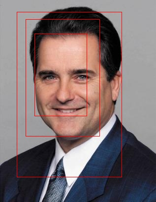
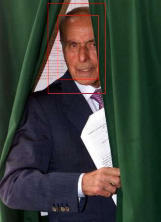

# ITLab Vision — Weekly Report — 2 November 2015

----------------

## Результаты

  1. Виноградов Владислав
     - 
  1. Долотов Евгений
     - Нарезал готовых картинок со слоя norm5(чтобы не пересчитывать каждый раз)
     - Пытался натренировать SVM. Пробовал различные ядра и параметры. Наилучшего результата удалось достичь с ядром POLY и degree=6. С остальными ядрами SVM всегда классифицировал изображение как "не лицо". 
     - Примеры работы детектора: 
     
     
  1. Кручинин Дмитрий
     -
  1. Малютина Екатерина
     -
  1. Бровкин Евгений
     -
  1. Жильцов Максим
     -
  1. Козицин Александр
     -
  1. Москаленко Виктор
     -
  1. Хизбуллин Ренат
     -
  1. Горохов Дмитрий
     -

## Планы

  1. Виноградов Владислав
     -
  1. Долотов Евгений
     - Построить рок-кривые
     - Реализовать объединение прямоугольников(NMS)
     - Спросить авторов про линейный SVM
  1. Малютина Екатерина
     -
  1. Бровкин Евгений
     -
  1. Жильцов Максим
     -
  1. Козицин Александр
     -
  1. Москаленко Виктор
     -
  1. Хизбуллин Ренат
     -
  1. Горохов Дмитрий
     -

## Проблемы
   1. Виноградов Владислав
     -
  1. Долотов Евгений
     -
  1. Кручинин Дмитрий
     -
  1. Малютина Екатерина
     -
  1. Бровкин Евгений
     -
  1. Жильцов Максим
     -
  1. Козицин Александр
     -
  1. Москаленко Виктор
     -
  1. Хизбуллин Ренат
     -
  1. Горохов Дмитрий
     -
