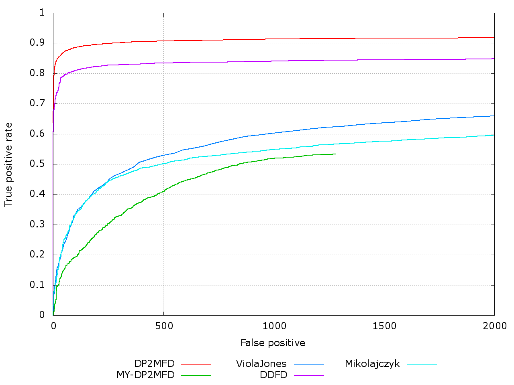

# ITLab Vision — Weekly Report — 23 November 2015

----------------

## Результаты

  1. Виноградов Владислав
     - 
  1. Долотов Евгений
     - Построил roc-кривые для своей натренированной модели. SVM имеет ядро POLY с шестой степенью. Тренировка проводилась на малом количетсве изображений(30 изображений из fddb) 
  1. Кручинин Дмитрий
     -
  1. Малютина Екатерина
     -
  1. Бровкин Евгений
     -
  1. Жильцов Максим
     -
  1. Козицин Александр
     -
  1. Москаленко Виктор
     -
  1. Хизбуллин Ренат
     -
  1. Горохов Дмитрий
     -

## Планы

  1. Виноградов Владислав
     -
  1. Долотов Евгений
     - Переобучать модель, пытаясь приблизиться к результату из статьи
     - Доделать описание алгоритма 
  1. Кручинин Дмитрий
     -
  1. Малютина Екатерина
     -
  1. Бровкин Евгений
     -
  1. Жильцов Максим
     -
  1. Козицин Александр
     -
  1. Москаленко Виктор
     -
  1. Хизбуллин Ренат
     -
  1. Горохов Дмитрий
     -

## Проблемы
   1. Виноградов Владислав
     -
  1. Долотов Евгений
     - Не могу зайти под своим логином\паролем на кластер
  1. Кручинин Дмитрий
     -
  1. Малютина Екатерина
     -
  1. Бровкин Евгений
     -
  1. Жильцов Максим
     -
  1. Козицин Александр
     -
  1. Москаленко Виктор
     -
  1. Хизбуллин Ренат
     -
  1. Горохов Дмитрий
     -
