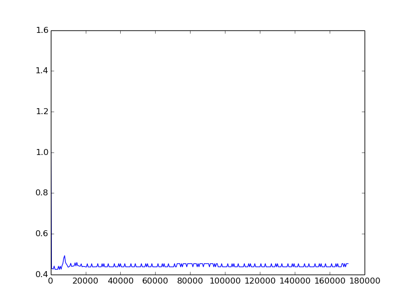

# ITLab Vision — Weekly Report — 30 November 2015

----------------

## Результаты

  1. Виноградов Владислав
     - Решены проблемы с установкой Линукса на свой компьютер
     - Изучен туториал [Deep Learning with Torch: the 60-minute blitz](https://github.com/soumith/cvpr2015/blob/master/Deep%20Learning%20with%20Torch.ipynb), запущены сэмплы и просмотрены коды [примеров](https://github.com/torch/tutorials)
  1. Долотов Евгений
     - [Добавил](https://github.com/DolotovEvgeniy/face-detection-model/tree/master/deep_pyramid) загрузку модели из конфигурационного xml файла
     - [Конфигурации](https://drive.google.com/file/d/0B6q4BSmVJim6QUR3MWJpYnZmckU/view?usp=sharing), с которыми запускалось обучение
     - [Результат](https://drive.google.com/folderview?id=0B6q4BSmVJim6VTN5TTNhdWJlZkk&usp=sharing) на изображениях из FDDB прошлого SVM
  1. Кручинин Дмитрий
     -
  1. Малютина Екатерина
     - Поменала базу негативов и запустила тренировку с ней. Итог: качествонно ошибка классификации не поменялась, попрежнему большая .
  1. Бровкин Евгений
     -
  1. Жильцов Максим
     -
  1. Козицин Александр
     -
  1. Москаленко Виктор
     -
  1. Хизбуллин Ренат
     -
  1. Горохов Дмитрий
     -

## Планы

  1. Виноградов Владислав
     - Написать конфигурацию сети Joint Deep
  1. Долотов Евгений
     - Дописать документ с описанием алгоритма
     - Тренировка модели
  1. Кручинин Дмитрий
     -
  1. Малютина Екатерина
     -
  1. Бровкин Евгений
     -
  1. Жильцов Максим
     -
  1. Козицин Александр
     -
  1. Москаленко Виктор
     -
  1. Хизбуллин Ренат
     -
  1. Горохов Дмитрий
     -

## Проблемы
   1. Виноградов Владислав
     - Установить Torch на виртульную машину Ubuntu не получилось (есть некоторые отличия по сравнения с установкой на чистую ОС), пришлось еще раз повозиться с установкой Ubuntu на свой компьютер (на этот раз успешно)
     - Сейчас нагрузка со временем, не успеваю что-либо существенное сделать
  1. Долотов Евгений
     -
  1. Кручинин Дмитрий
     -
  1. Малютина Екатерина
     - 
  1. Бровкин Евгений
     -
  1. Жильцов Максим
     -
  1. Козицин Александр
     -
  1. Москаленко Виктор
     -
  1. Хизбуллин Ренат
     -
  1. Горохов Дмитрий
     -
