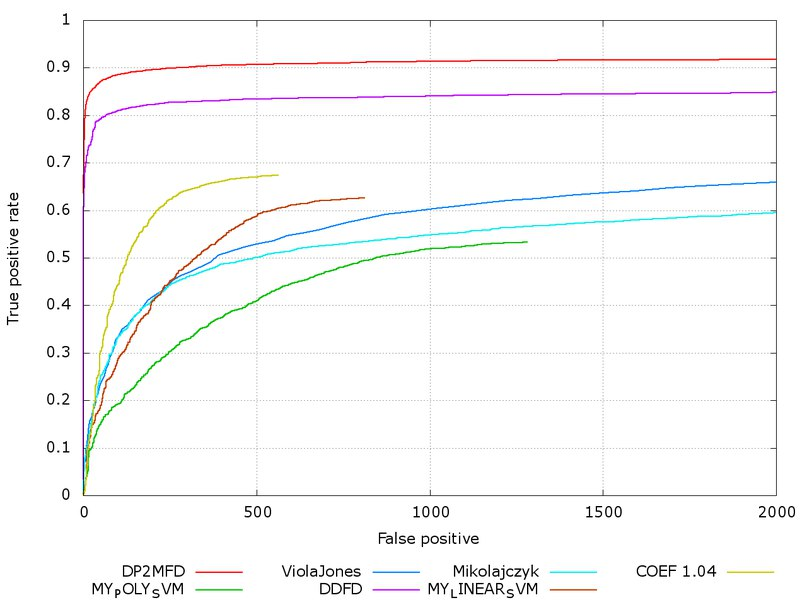

# ITLab Vision — Weekly Report — 7 December 2015

----------------

## Результаты

  1. Виноградов Владислав
     - 
  1. Долотов Евгений
     - Исправлял замечания по коду
     - Перетренировывал SVM
     - Лучший результат на данный момент: 
     
  1. Кручинин Дмитрий
     -
  1. Малютина Екатерина
     - Пробовала подобрать lr у сети, для улучшения сходимости. Улучшений не получилось. 
  1. Бровкин Евгений
     -
  1. Жильцов Максим
     - Писал статью, готовил результаты работы сетей, видео.
     - Написал [утилиту](https://github.com/ITLab-Vision/ITLab-Vision-deeplab/pull/12) для перевода mat в png с цветной или ч/б сегментацией.
  1. Козицин Александр
     -
  1. Москаленко Виктор
     - Написал [первую версию] (https://github.com/ITLab-Vision/pedestrian-detection/commit/2f9eccbd4098fed2f8dd89f97339968eb4dd9678) предобработки изображений для [Joint Deep](http://www.ee.cuhk.edu.hk/~xgwang/papers/ouyangWiccv13.pdf)
  1. Хизбуллин Ренат
     -
  1. Горохов Дмитрий
     -

## Планы

  1. Виноградов Владислав
     -
  1. Долотов Евгений
     - Дописать документ с описанием алгоритма
     - Тренировка модели
  1. Кручинин Дмитрий
     - 
  1. Малютина Екатерина
     - Посмотреть как caffe перемешивает данные (параметр shuffle = true ).
     - Проверить патчи картинок, на которых тренировка сети ломается.
  1. Бровкин Евгений
     -
  1. Жильцов Максим
     - Подготовить картинки для статьи.
     - Отослать оставшиеся результаты (публичные сети).
  1. Козицин Александр
     -
  1. Москаленко Виктор
     - Дописать [скрипт] (https://github.com/ITLab-Vision/pedestrian-detection/commit/2f9eccbd4098fed2f8dd89f97339968eb4dd9678)
  1. Хизбуллин Ренат
     -
  1. Горохов Дмитрий
     -

## Проблемы

  1. Виноградов Владислав
     -
  1. Долотов Евгений
     -
  1. Кручинин Дмитрий
     -
  1. Малютина Екатерина
     -
  1. Бровкин Евгений
     -
  1. Жильцов Максим
     -
  1. Козицин Александр
     -
  1. Москаленко Виктор
     -
  1. Хизбуллин Ренат
     -
  1. Горохов Дмитрий
     -
