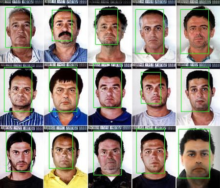

# ITLab Vision — Weekly Report — 9 April 2016

## Результаты

  1. Виноградов Владислав
     -
  1. Долотов Евгений
     -  построенная на все FDDB
     -  детектора
  1. Кручинин Дмитрий
     -
  1. Малютина Екатерина
     -
  1. Бровкин Евгений
     -
  1. Жильцов Максим
     -
  1. Козицин Александр
     -
  1. Москаленко Виктор
     - Обновлял статью по [SegNet](https://docs.google.com/document/d/1sRZ30NrY-_ynffXDhFumABwWL_Lbls2eQoCu4Y1920s/edit?ts=56f28cc6)
  1. Хизбуллин Ренат
     -

## Планы

  1. Виноградов Владислав
     -
  1. Долотов Евгений
     - Тренировка всей модели
  1. Кручинин Дмитрий
     -
  1. Малютина Екатерина
     -
  1. Бровкин Евгений
     -
  1. Жильцов Максим
     -
  1. Козицин Александр
     -
  1. Москаленко Виктор
     - Продолжить написание статьи по [SegNet](https://docs.google.com/document/d/1sRZ30NrY-_ynffXDhFumABwWL_Lbls2eQoCu4Y1920s/edit?ts=56f28cc6)
  1. Хизбуллин Ренат
     -

## Проблемы
  1. Виноградов Владислав
     -
  1. Долотов Евгений
     -
  1. Кручинин Дмитрий
     -
  1. Малютина Екатерина
     -
  1. Бровкин Евгений
     -
  1. Жильцов Максим
     -
  1. Козицин Александр
     -
  1. Москаленко Виктор
     -
  1. Хизбуллин Ренат
     -
