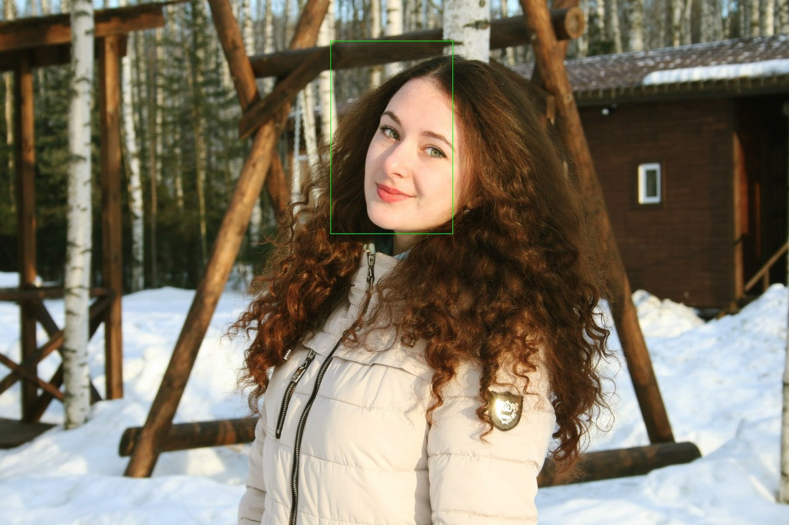
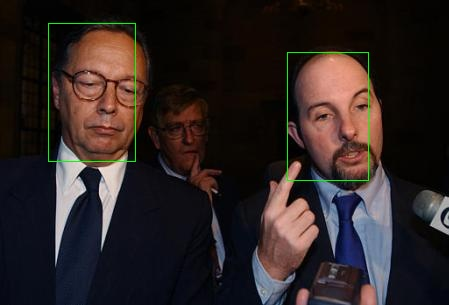
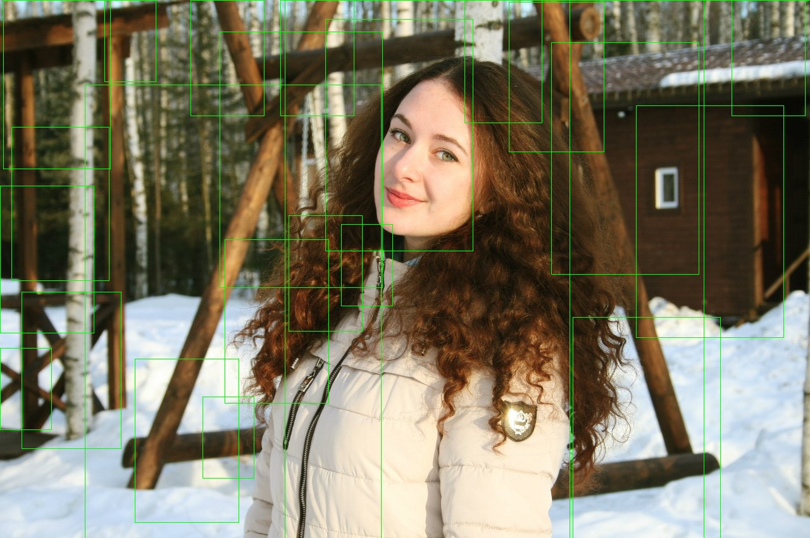
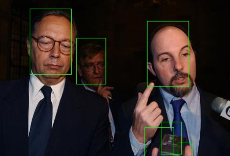

# ITLab Vision — Weekly Report — 23 April 2016

## Результаты

  1. Виноградов Владислав
     -
  1. Долотов Евгений
     - Тренировал SVM
     - Результаты прошлого SVM
     
     
     - Результаты натренированного SVM
     
     
  1. Кручинин Дмитрий
     -
  1. Малютина Екатерина
     -
  1. Бровкин Евгений
     -
  1. Жильцов Максим
     -
  1. Козицин Александр
     -
  1. Москаленко Виктор
     -
  1. Хизбуллин Ренат
     -

## Планы

  1. Виноградов Владислав
     -
  1. Долотов Евгений
     -
  1. Кручинин Дмитрий
     -
  1. Малютина Екатерина
     -
  1. Бровкин Евгений
     -
  1. Жильцов Максим
     -
  1. Козицин Александр
     -
  1. Москаленко Виктор
     -
  1. Хизбуллин Ренат
     -

## Проблемы
  1. Виноградов Владислав
     -
  1. Долотов Евгений
     - SVM оцень долго тренируется(целый день на 85 000 семплов)
  1. Кручинин Дмитрий
     -
  1. Малютина Екатерина
     -
  1. Бровкин Евгений
     -
  1. Жильцов Максим
     -
  1. Козицин Александр
     -
  1. Москаленко Виктор
     -
  1. Хизбуллин Ренат
     -
